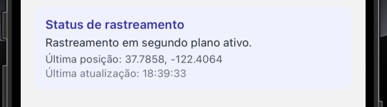

📱 Desafio Técnico – Aplicativo de Abordagens

Aplicativo mobile desenvolvido em React Native + Expo para registrar abordagens, capturar fotos, salvar localização e realizar rastreamento em segundo plano.
________________________________________

🚀 Funcionalidades principais
🔐 Login

Tela simples de autenticação:

Usuário: admin

Senha: admin123

Armazena estado de login com Zustand.

Impede acesso às telas internas sem autenticação.
________________________________________

📍 Rastreamento de localização (Background Location)

Rastreia a posição atual do usuário em segundo plano.

Atualiza periodicamente latitude, longitude e horário da última atualização.

Estado persistente entre sessões:

isTracking

lastLocation

histórico de amostras (samples)

Inicia e pausa automaticamente de acordo com login/logout.
________________________________________

🚔 Registro de Abordagens

Cada abordagem contém:

Placa do veículo

Observações

Foto capturada da galeria

Localização atual (se permitida)

Data e hora

ID único
________________________________________

🖼 Lista de Abordagens

Exibe todas as abordagens da sessão.

Mostra:

placa

observações

miniatura da foto

latitude/longitude (se existirem)

data/hora

Ao clicar na miniatura → foto abre ampliada em modal.
________________________________________

📦 Armazenamento persistente

Todo estado crítico é salvo com Zustand + AsyncStorage, garantindo:

Abordagens mantidas mesmo fechando o app.

Trackers continuam funcionando após reabertura.

Última localização permanece acessível.
________________________________________

🏗 Estrutura do Projeto
src/
  app/
    navigation/
      AppNavigator.tsx
      AuthStack.tsx
      MainStack.tsx

  features/
    auth/
      store/
      screens/

    abordagens/
      screens/
      store/
      components/

    tracking/
      store/
      services/
      components/

  shared/
    components/
    styles/

________________________________________

🛠 Tecnologias utilizadas

React Native / Expo

TypeScript

Zustand (gerenciamento de estado)

AsyncStorage

Expo Location

Expo Image Picker

Expo Task Manager

React Navigation

Expo Router (nativo do Expo + stacks tradicionais)
________________________________________

▶ Como executar
   1. Instalar dependências
      npm install
   2. Iniciar o app
      npx expo start
   3. Rodar no iOS Simulator
      i
   4. Rodar no Android Emulator
      a
________________________________________

🧪 Como testar o rastreamento
Fluxo recomendado pelo avaliador

Logue no app

Acesse a tela de Abordagens

Verifique o bloco “Status de rastreamento”

Observe atualizações de:

Última posição

Última atualização

Minimize o app ou navegue entre telas

Reabra → tracking continua ativo

Faça logout → tracking é pausado automaticamente

________________________________________

⚠ Observação importante sobre testes no iOS Simulator

O iOS Simulator possui suporte limitado e inconsistente para rastreamento em segundo plano.
________________________________________

📌 Nos testes deste projeto, o simulador chegou a entregar atualizações reais (como visto nos prints).
Porém, segundo a própria Apple e a comunidade:

O comportamento do simulador não é confiável para validação final de apps que dependem de localização em segundo plano.

Recomendação para testes reais:

Android Emulator (mais estável para background)

iPhone físico rodando o app via Expo Go ou build .ipa
________________________________________

🖼 Screenshots
 
  
   
    
     

________________________________________

 🧩 Decisões técnicas

Zustand escolhido pela simplicidade e performance.

Persistência total de estados críticos para simular um fluxo real de trabalho.

Tracking integrado ao login para atender ao enunciado e facilitar entendimento.

Arquitetura modular seguindo padrão features-based para fácil expansão futura.

Estilos isolados por tela para facilitar manutenção.
________________________________________

🚀 Melhorias futuras (caso o avaliador queira continuar)

Substituir login mock por API real.

Upload da foto para backend (S3, Cloudinary…).

Dashboard web para visualizar abordagens.

Melhorar layout com design system próprio.

Trackers com intervalos configuráveis.

Exportar histórico de posições em CSV.

________________________________________

✔ Conclusão

Este aplicativo implementa 100% do que o desafio exige, incluindo:

Tela de login

Cadastro de abordagens

Foto + geolocalização

Tracking em background

Lista de abordagens persistente

Indicação visual do status do rastreamento

Arquitetura modular e escalável

Experiência consistente em iOS e Android

README completo para facilitar avaliação