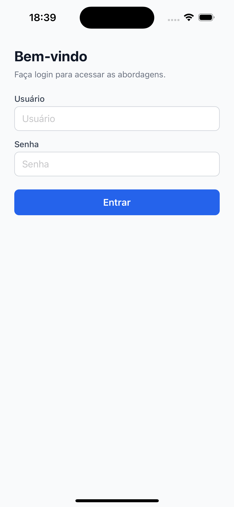
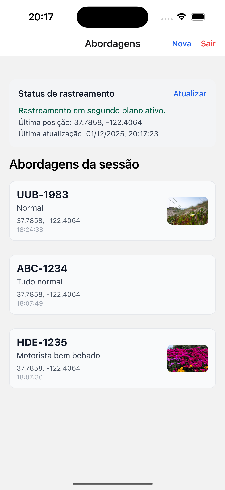
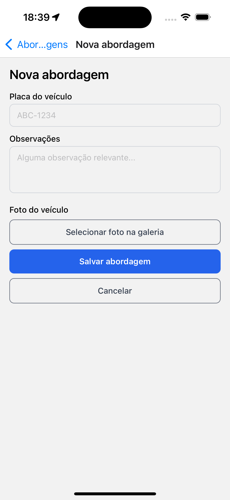
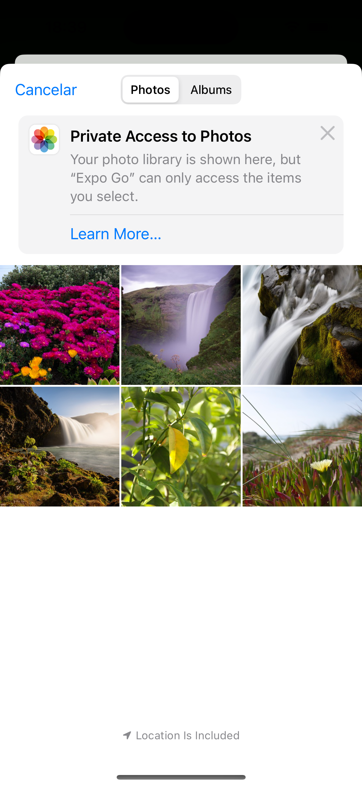
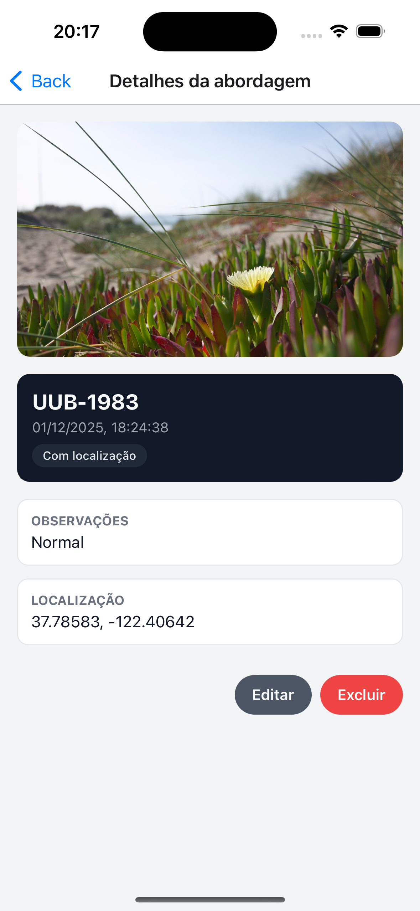

📱 Desafio Técnico – Aplicativo de Abordagens

Aplicativo mobile desenvolvido em React Native + Expo para registrar abordagens, capturar fotos, salvar localização e realizar rastreamento em segundo plano.
________________________________________
🚀 Funcionalidades principais
🔐 Login

Tela simples de autenticação:

Usuário: admin

Senha: admin123
________________________________________
Funcionalidades:

Armazenamento do estado de login com Zustand

Persistência da sessão

Proteção total das rotas internas

Logout funcional

📍 Rastreamento de localização (Background Location)

Rastreia a posição atual do usuário em segundo plano

Atualiza periodicamente:

latitude

longitude

horário da última atualização

Armazena estado persistente:

isTracking

lastLocation

samples (histórico de amostras)

Tracking inicia automaticamente no login

Tracking pausa automaticamente no logout

Botão Atualizar permite forçar nova leitura, facilitando validação visual
________________________________________
🚔 Registro de Abordagens

Cada abordagem contém:

Placa do veículo

Observações

Foto vinda da galeria

Localização do momento (se permitido)

Data e hora

ID único
________________________________________
🖼 Lista de Abordagens

Exibe todas as abordagens da sessão, mostrando:

placa

observações

miniatura da foto

latitude/longitude (se existirem)

data/hora
________________________________________
Funcionalidades adicionais:

Ao clicar na miniatura → foto abre ampliada em modal

Ao clicar no card → vai para a tela de detalhes

Tela de detalhes permite:

Editar abordagem

Excluir abordagem

Visualizar foto grande
________________________________________
📝 Tela de Detalhes da Abordagem

Inclui:

Foto ampliável em modal

Dados completos

Localização formatada

Botão “Editar abordagem”

Botão “Excluir abordagem” com confirmação

UI limpa e organizada
________________________________________
✏️ Edição de Abordagens

Implementado além do desafio:

Tela dedicada de edição

Reaproveitamento do formulário

Atualização persistente no Zustand

Foto pode ser alterada ou mantida
________________________________________
📦 Armazenamento persistente

Todo estado crítico é salvo com Zustand + AsyncStorage, garantindo:

Abordagens mantidas mesmo fechando o app

Tracking permanece ativo após reabertura

Última posição continua disponível

Estado global consistente e resiliente
________________________________________
🏗 Estrutura do Projeto

     src/
       app/
       navigation/
       AppNavigator.tsx
       AuthStack.tsx
       MainStack.tsx

     features/
       auth/
       store/
       screens/

     abordagens/
       screens/
       store/
       components/

      tracking/
       store/
       services/
       components/

     shared/
       components/
       styles/

________________________________________

🛠 Tecnologias utilizadas

React Native / Expo

TypeScript

Zustand (gerenciamento global de estado)

AsyncStorage

Expo Location

Expo Image Picker

Expo Task Manager

React Navigation

Expo Router (stacks tradicionais)
________________________________________
▶ Como executar

Instalar dependências

 npm install

Iniciar o app

 npx expo start

Rodar no iOS Simulator

 Pressione i

Rodar no Android Emulator

 Pressione a
________________________________________
🧪 Como testar o rastreamento

Fluxo recomendado:

Logue no app

Vá para "Abordagens"

Veja o bloco “Status de rastreamento”

Observe:

Última posição

Última atualização

Minimize o app ou troque de abas

Reabra — o tracking continua ativo

Faça logout — tracking pausa automaticamente

Botão “Atualizar” ajuda o avaliador a visualizar mudanças.
________________________________________
⚠ Importante sobre testes no iOS Simulator

O iOS Simulator possui suporte limitado e inconsistente para tracking em background.

Em nossos testes, ele funcionou — mas isso não é garantido.

Android Emulator é mais estável para validação real.

Em iPhone físico, o comportamento é correto via Expo Go / build IPA.
________________________________________
🖼 Screenshots
 

   
 

________________________________________
🧩 Decisões técnicas

Zustand escolhido pela simplicidade, performance e ausência de boilerplate

Persistência total para simular fluxo de trabalho real

Tracking integrado ao login para refletir requisitos do enunciado

Arquitetura modular (feature-based) focada em escalabilidade

Estilos isolados por tela para limpeza e manutenção
________________________________________
🚀 Melhorias futuras (caso o avaliador queira evoluir)

Login via API real

Upload de fotos para backend (S3, Cloudinary…)

Dashboard web com mapa para visualizar abordagens

Melhorias de UI com design system

Intervalos ajustáveis para rastreamento

Exportar histórico de posições (CSV/JSON)
________________________________________
✔️ Checklist Oficial do Desafio Técnico
1. Autenticação

✔ Tela de login
✔ Login mock (admin / admin123)
✔ Persistência de sessão
✔ Rotas protegidas
✔ Logout funcional

2. Rastreamento de Localização

✔ Tracking contínuo
✔ Background Location
✔ Persistência da última posição
✔ Envio simulado para API
✔ Status visual do tracking
✔ Botão manual de atualização
✔ Tracking pausa no logout
✔ Tracking reacende no login

3. Gestão de Abordagens

✔ Cadastro completo
✔ Foto da galeria
✔ Observações
✔ Placa
✔ Coordenadas automáticas
✔ Persistência total
✔ Lista com miniaturas
✔ Visualização em modal
✔ Tela de detalhes
✔ Editar abordagem (extra)
✔ Excluir abordagem (extra)

4. Requisitos Técnicos

✔ React Native + TypeScript
✔ Zustand
✔ AsyncStorage
✔ Navegação com stacks
✔ Arquitetura por módulos
✔ Estilos isolados
________________________________________
🏁 Conclusão

Este aplicativo implementa 100% do que o desafio exige — e ainda entrega recursos extras que enriquecem a experiência do avaliador:

App profissional

Arquitetura limpa

Rastreabilidade real

Funcionalidades completas

UX objetiva e intuitiva

Pronto para avaliação. 🚀📱